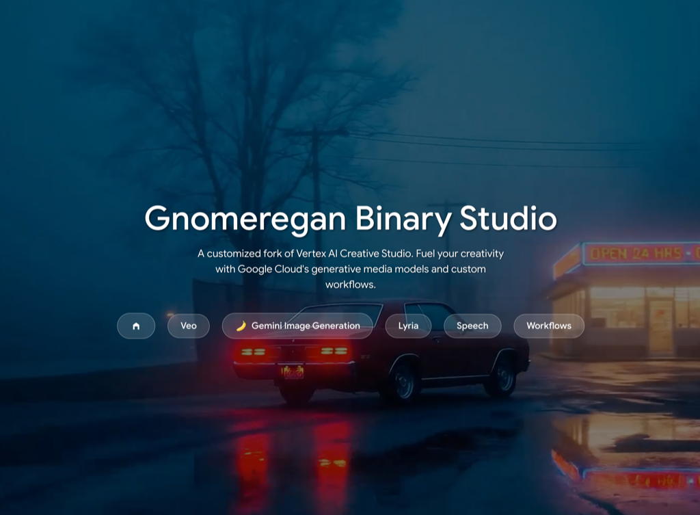
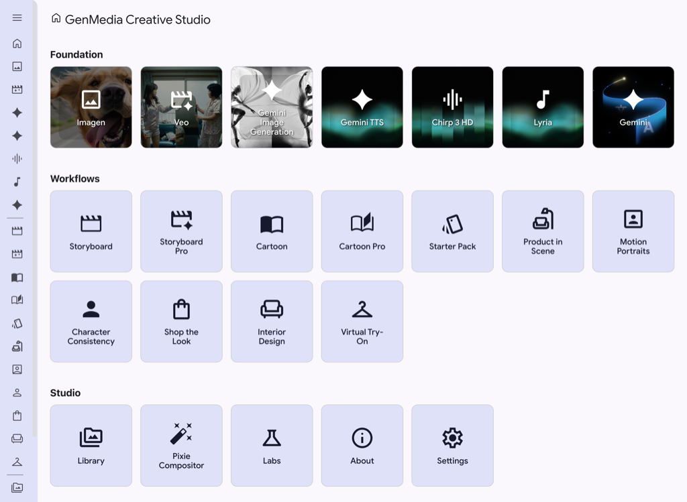
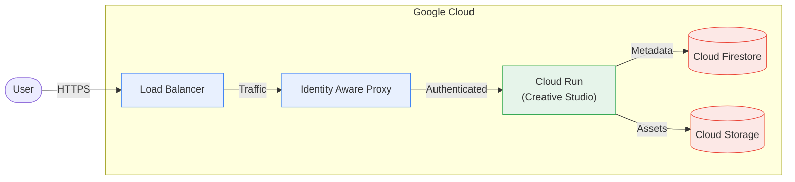
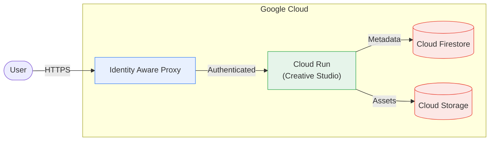

[English](#english) | [한국어](#korean)

<a id="english"></a>

# Gnomeregan Binary Studio

A customized fork of Vertex AI Creative Studio https://github.com/GoogleCloudPlatform/vertex-ai-creative-studio

> ###### _This is not an officially supported Google product. This project is not eligible for the [Google Open Source Software Vulnerability Rewards Program](https://bughunters.google.com/open-source-security). This project is intended for demonstration purposes only. It is not intended for use in a production environment._





## Table of Contents

- [Gnomeregan Binary Studio | Vertex AI](#gnomeregan-binary-studio--vertex-ai)
- [Table of Contents](#table-of-contents)
- [Gnomeregan Binary Studio](#gnomeregan-binary-studio)
- [Deploying Gnomeregan Binary Studio](#deploying-gnomeregan-binary-studio)
- [Updating Gnomeregan Binary Studio](#updating-gnomeregan-binary-studio)
  - [Updating Application Code](#updating-application-code)
  - [Updating Infrastructure](#updating-infrastructure)
- [Adding Additional Users](#adding-additional-users)
- [Solution Design](#solution-design)
  - [Custom Domain Using Identity Aware Proxy w/Load Balancer](#custom-domain-using-identity-aware-proxy-wload-balancer)
  - [Cloud Run Domain Using Identity Aware Proxy w/Cloud Run](#cloud-run-domain-using-identity-aware-proxy-wcloud-run)
  - [Solution Components](#solution-components)
    - [Runtime Components](#runtime-components)
    - [Build time Components](#build-time-components)
  - [Setting up your development environment](#setting-up-your-development-environment)
    - [Python virtual environment](#python-virtual-environment)
    - [Application Environment variables](#application-environment-variables)
  - [Gnomeregan Binary Studio - Developing](#gnomeregan-binary-studio---developing)
    - [Running](#running)
    - [Developing](#developing)
  - [Contributing changes](#contributing-changes)
  - [Licensing](#licensing)

## Gnomeregan Binary Studio

> **Browser Compatibility:** For the best experience, we recommend using Google Chrome. Some features may not work as expected on other browsers, such as Safari or Firefox.

Gnomeregan Binary Studio is a web application showcasing Google Cloud's generative media - Veo, Lyria, Chirp, Gemini 2.5 Flash Image Generation (nano-banana), and Gemini TTS along with custom workflows and techniques for creative exploration and inspiration. We're looking forward to see what you create!

Current featureset

- Image: Imagen 3, Imagen 4, Virtual Try-On, Gemini 2.5 Flash Image Generation
- Video: Veo 2, Veo 3
- Music: Lyria
- Speech: Chirp 3 HD, Gemini Text to Speech
- Workflows: Character Consistency, Shop the Look, Starter Pack Moodboard, Interior Designer, Cartoon Pro
- Asset Library

This is built using [Mesop](https://mesop-dev.github.io/mesop/), an open source Python framework used at Google for rapid AI app development, and the [scaffold for Studio style apps](https://github.com/ghchinoy/studio-scaffold).

## 🤖 AI Assistants

This repository uses **Google's Gemini CLI** to automate software engineering tasks.

- **Code Reviewer:** Automatically reviews Pull Requests for bugs and security issues.
- **Issue Triage:** Automatically labels and categorizes new issues.
- **Maintainer Commands:** Allows maintainers to manually trigger reviews (`@gemini-cli /review`) or ask questions (`@gemini-cli Explain this...`).

For detailed documentation on the agents and workflows, see [AGENTS.md](./AGENTS.md).

## Deploying Gnomeregan Binary Studio

Deployment of Gnomeregan Binary Studio is accomplished using a combination of Terraform and Cloud Build.

For detailed, step-by-step instructions on deploying the application using either a Custom Domain or a Cloud Run Domain, please refer to the **[Deployment & Resources Guide](DEPLOY.md)**.

## Updating Gnomeregan Binary Studio

As new features and fixes are added to Gnomeregan Binary Studio, you will want to update your deployment. You do **not** need to destroy your existing infrastructure.

### Updating Application Code

If you only need to update the application code (Python files, UI changes):

1. Pull the latest changes from the repository:

   ```bash
   git pull
   ```

2. Run the build script:

   ```bash
   ./build.sh
   ```

### Updating Infrastructure

If the updates include changes to the Terraform configuration (e.g., new environment variables, new Google Cloud services):

1. Pull the latest changes:

   ```bash
   git pull
   ```

2. Initialize Terraform to download any new provider requirements:

   ```bash
   terraform init -upgrade
   ```

3. Apply the changes. Terraform will only update what has changed:

   ```bash
   terraform apply
   ```

## Adding Additional Users

With any of the deployment options above that use IAP, if you need to add additional users, there are two steps to take to make sure those users can both access the application and the images generated.

For detailed instructions on adding internal vs. external users and troubleshooting access issues, please refer to the **[Deployment & Resources Guide (DEPLOY.md)](DEPLOY.md#user-management)**.

# Frequently Asked Questions

For common questions and troubleshooting tips, please refer to the [FAQ](FAQ.md).

# Solution Design

There are two way to deploy this solution. One using a custom domain with a load balancer and IAP integration. The other is using Cloud Run's default URL and integrating IAP with Cloud Run. The below diagrams depict the components used for each option.

## Custom Domain Using Identity Aware Proxy w/Load Balancer



## Cloud Run Domain Using Identity Aware Proxy w/Cloud Run


The above diagram depicts the components that make up the Creative Studio solution. Items of note:

- DNS entry _is not_ deployed as part of the provided Terraform configuration files. You will need to create a DNS A record that resolves to the IP address of the provisioned load balancer so that certificate provisioning succeeds.
- Users are authenticated with Google Accounts and access is [managed through Identity Aware Proxy (IAP)](https://cloud.google.com/iap/docs/managing-access). IAP does support external identities and you can learn more [here](https://cloud.google.com/iap/docs/enable-external-identities).

## Solution Components

### Runtime Components

- [Load Balancer](https://cloud.google.com/load-balancing) - Provides the HTTP access to the Cloud Run hosted application
- [Identity Aware Proxy](https://cloud.google.com/security/products/iap) - Limits access to web application for only authenticated users or groups
- [Cloud Run](https://cloud.google.com/run) - Serverless container runtime used to host Mesop application
- [Cloud Firestore](https://firebase.google.com/docs/firestore) - Data store for the image / video / audio metadata.
- [Cloud Storage](https://cloud.google.com/storage) - A bucket is used to store the image / video / audio files

### Build time Components

- [Cloud Build](https://cloud.google.com/build) - Uses build packs to create the container images, push them to Artifact Registry and update the Cloud Run service to use the latest image version.
- [Artifact Registry](https://cloud.google.com/artifact-registry/docs/overview) - Used to store the container images for the web aplication
- [Cloud Storage](https://cloud.google.com/storage) - A bucket is used to store a compressed file of the source used for the build

## Setting up your development environment

### Python virtual environment

A python virtual environment, with required packages installed.

Using the [uv](https://github.com/astral-sh/uv) virtual environment and package manager:

```bash
uv sync
```

### Application Environment variables

Use the included dotenv.template and create a `.env` file with your specific environment variables.

Only one environment variable is required:

- `PROJECT_ID` your Google Cloud Project ID, obtained via `gcloud config get project`

## Gnomeregan Binary Studio - Developing

### Running

Once you have your environment variables set, either on the command line or an in .env file:

```bash
uv run main.py
```

### Developing

Please see the [Developer's Guide](./DEVELOPERS_GUIDE.md) for more information on how this application was built.

When developing this app, since it's a FastAPI application that serves Mesop, please use the following:

```bash
uv run main.py
```

Traditional Mesop hot reload capabilities (i.e. `mesop main.py`) are not fully available at this time.

## Contributing changes

Interested in contributing? Please open an issue describing the intended change. Additionally, bug fixes are welcome, either as pull requests or as GitHub issues.

See [CONTRIBUTING.md](CONTRIBUTING.md) for details on how to contribute.

## Licensing

Code in this repository is licensed under the Apache 2.0. See [LICENSE](LICENSE).

---

<a id="korean"></a>

# Gnomeregan Binary Studio

A customized fork of Vertex AI Creative Studio https://github.com/GoogleCloudPlatform/vertex-ai-creative-studio

> ###### _이 제품은 Google에서 공식적으로 지원하는 제품이 아닙니다. 이 프로젝트는 [Google 오픈소스 소프트웨어 취약점 보상 프로그램](https://bughunters.google.com/open-source-security)의 대상이 아닙니다. 이 프로젝트는 데모 목적으로만 제공됩니다. 프로덕션 환경에서의 사용을 목적으로 하지 않습니다._


## 목차

- [Gnomeregan Binary Studio | Vertex AI](#gnomeregan-binary-studio--vertex-ai)
- [목차](#목차)
- [Gnomeregan Binary Studio](#gnomeregan-binary-studio-1)
- [Gnomeregan Binary Studio 배포하기](#gnomeregan-binary-studio-배포하기)
- [Gnomeregan Binary Studio 업데이트](#gnomeregan-binary-studio-업데이트)
  - [애플리케이션 코드 업데이트](#애플리케이션-코드-업데이트)
  - [인프라 업데이트](#인프라-업데이트)
- [추가 사용자 추가](#추가-사용자-추가)
- [솔루션 설계](#솔루션-설계)
  - [로드 밸런서와 Identity Aware Proxy를 사용한 사용자 지정 도메인](#로드-밸런서와-identity-aware-proxy를-사용한-사용자-지정-도메인)
  - [Cloud Run과 Identity Aware Proxy를 사용한 Cloud Run 도메인](#cloud-run과-identity-aware-proxy를-사용한-cloud-run-도메인)
  - [솔루션 구성 요소](#솔루션-구성-요소)
    - [런타임 구성 요소](#런타임-구성-요소)
    - [빌드 타임 구성 요소](#빌드-타임-구성-요소)
  - [개발 환경 설정](#개발-환경-설정)
    - [Python 가상 환경](#python-가상-환경)
    - [애플리케이션 환경 변수](#애플리케이션-환경-변수)
  - [Gnomeregan Binary Studio - 개발](#gnomeregan-binary-studio---개발)
    - [실행](#실행)
    - [개발](#개발-1)
  - [변경 사항 기여](#변경-사항-기여)
  - [라이선스](#라이선스)

## Gnomeregan Binary Studio

> **브라우저 호환성:** 최상의 경험을 위해 Google Chrome을 사용하는 것을 권장합니다. Safari나 Firefox와 같은 다른 브라우저에서는 일부 기능이 예상대로 작동하지 않을 수 있습니다.

Gnomeregan Binary Studio는 Google Cloud의 생성형 미디어(Veo, Lyria, Chirp, Gemini 2.5 Flash 이미지 생성(nano-banana), Gemini TTS)와 창의적 탐색 및 영감을 위한 맞춤형 워크플로 및 기술을 보여주는 웹 애플리케이션입니다. 여러분이 무엇을 만들어낼지 기대됩니다!

현재 기능 세트:

- 이미지: Imagen 3, Imagen 4, 가상 착용(Virtual Try-On), Gemini 2.5 Flash 이미지 생성
- 비디오: Veo 2, Veo 3
- 음악: Lyria
- 음성: Chirp 3 HD, Gemini Text to Speech
- 워크플로: 캐릭터 일관성, 샵 더 룩(Shop the Look), 스타터 팩 무드보드, 인테리어 디자이너, Cartoon Pro
- 자산 라이브러리

이 애플리케이션은 Google에서 빠른 AI 앱 개발을 위해 사용하는 오픈 소스 Python 프레임워크인 [Mesop](https://mesop-dev.github.io/mesop/)과 [Studio 스타일 앱용 스캐폴드](https://github.com/ghchinoy/studio-scaffold)를 사용하여 구축되었습니다.

## 🤖 AI 어시스턴트

이 리포지토리는 **Google의 Gemini CLI**를 사용하여 소프트웨어 엔지니어링 작업을 자동화합니다.

- **코드 리뷰어:** 버그 및 보안 문제에 대해 PR을 자동으로 검토합니다.
- **이슈 분류:** 새 이슈를 자동으로 라벨링하고 분류합니다.
- **유지 관리자 명령:** 유지 관리자가 수동으로 검토를 트리거(`@gemini-cli /review`)하거나 질문(`@gemini-cli Explain this...`)할 수 있습니다.

에이전트 및 워크플로에 대한 자세한 문서는 [AGENTS.md](./AGENTS.md)를 참조하세요.

## Gnomeregan Binary Studio 배포하기

Gnomeregan Binary Studio의 배포는 Terraform과 Cloud Build의 조합을 사용하여 수행됩니다.

사용자 지정 도메인 또는 Cloud Run 도메인을 사용하여 애플리케이션을 배포하는 방법에 대한 자세한 단계별 지침은 **[배포 및 리소스 가이드 (DEPLOY.md)](DEPLOY.md)**를 참조하세요.

## Gnomeregan Binary Studio 업데이트

Gnomeregan Binary Studio에 새로운 기능과 수정 사항이 추가됨에 따라 배포를 업데이트하고 싶을 것입니다. 기존 인프라를 삭제할 필요는 **없습니다**.

### 애플리케이션 코드 업데이트

애플리케이션 코드(Python 파일, UI 변경 사항)만 업데이트해야 하는 경우:

1. 리포지토리에서 최신 변경 사항을 가져옵니다:

   ```bash
   git pull
   ```

2. 빌드 스크립트를 실행합니다:

   ```bash
   ./build.sh
   ```

### 인프라 업데이트

업데이트에 Terraform 구성 변경 사항(예: 새 환경 변수, 새 Google Cloud 서비스)이 포함된 경우:

1. 최신 변경 사항을 가져옵니다:

   ```bash
   git pull
   ```

2. Terraform을 초기화하여 새로운 공급자 요구 사항을 다운로드합니다:

   ```bash
   terraform init -upgrade
   ```

3. 변경 사항을 적용합니다. Terraform은 변경된 내용만 업데이트합니다:

   ```bash
   terraform apply
   ```

## 추가 사용자 추가

IAP를 사용하는 위의 배포 옵션 중 하나를 사용할 때 추가 사용자를 추가해야 하는 경우, 해당 사용자가 애플리케이션과 생성된 이미지에 모두 액세스할 수 있도록 두 가지 조치를 취해야 합니다.

내부 및 외부 사용자 추가와 액세스 문제 해결에 대한 자세한 지침은 **[배포 및 리소스 가이드 (DEPLOY.md)](DEPLOY.md#user-management-1)**를 참조하세요.

# 자주 묻는 질문 (FAQ)

일반적인 질문과 문제 해결 팁은 [FAQ](FAQ.md)를 참조하세요.

# 솔루션 설계

이 솔루션을 배포하는 방법에는 두 가지가 있습니다. 하나는 로드 밸런서와 IAP 통합이 있는 사용자 지정 도메인을 사용하는 것입니다. 다른 하나는 Cloud Run의 기본 URL을 사용하고 IAP를 Cloud Run과 통합하는 것입니다. 아래 다이어그램은 각 옵션에 사용되는 구성 요소를 보여줍니다.

## 로드 밸런서와 Identity Aware Proxy를 사용한 사용자 지정 도메인


## Cloud Run과 Identity Aware Proxy를 사용한 Cloud Run 도메인



위 다이어그램은 Creative Studio 솔루션을 구성하는 구성 요소를 보여줍니다. 참고 사항:

- DNS 항목은 제공된 Terraform 구성 파일의 일부로 배포되지 **않습니다**. 인증서 프로비저닝이 성공하려면 프로비저닝된 로드 밸런서의 IP 주소로 확인되는 DNS A 레코드를 생성해야 합니다.
- 사용자는 Google 계정으로 인증되며 액세스는 [Identity Aware Proxy (IAP)](https://cloud.google.com/iap/docs/managing-access)를 통해 관리됩니다. IAP는 외부 ID를 지원하며 [여기](https://cloud.google.com/iap/docs/enable-external-identities)에서 자세한 내용을 확인할 수 있습니다.

## 솔루션 구성 요소

### 런타임 구성 요소

- [로드 밸런서(Load Balancer)](https://cloud.google.com/load-balancing) - Cloud Run 호스팅 애플리케이션에 대한 HTTP 액세스를 제공합니다.
- [Identity Aware Proxy](https://cloud.google.com/security/products/iap) - 인증된 사용자 또는 그룹만 웹 애플리케이션에 액세스하도록 제한합니다.
- [Cloud Run](https://cloud.google.com/run) - Mesop 애플리케이션을 호스팅하는 데 사용되는 서버리스 컨테이너 런타임입니다.
- [Cloud Firestore](https://firebase.google.com/docs/firestore) - 이미지/비디오/오디오 메타데이터를 위한 데이터 스토어입니다.
- [Cloud Storage](https://cloud.google.com/storage) - 이미지/비디오/오디오 파일을 저장하는 데 버킷이 사용됩니다.

### 빌드 타임 구성 요소

- [Cloud Build](https://cloud.google.com/build) - 빌드 팩을 사용하여 컨테이너 이미지를 생성하고, Artifact Registry로 푸시하고, 최신 이미지 버전을 사용하도록 Cloud Run 서비스를 업데이트합니다.
- [Artifact Registry](https://cloud.google.com/artifact-registry/docs/overview) - 웹 애플리케이션용 컨테이너 이미지를 저장하는 데 사용됩니다.
- [Cloud Storage](https://cloud.google.com/storage) - 빌드에 사용되는 소스의 압축 파일을 저장하는 데 버킷이 사용됩니다.

## 개발 환경 설정

### Python 가상 환경

필요한 패키지가 설치된 Python 가상 환경입니다.

[uv](https://github.com/astral-sh/uv) 가상 환경 및 패키지 관리자를 사용하여 다음을 실행합니다:

```bash
uv sync
```

### 애플리케이션 환경 변수

포함된 `dotenv.template`을 사용하여 특정 환경 변수로 `.env` 파일을 생성하세요.

최소한 하나의 환경 변수가 필요합니다:

- `PROJECT_ID`: 귀하의 Google Cloud 프로젝트 ID (`gcloud config get project`를 통해 확인 가능)

## Gnomeregan Binary Studio - 개발

### 실행

환경 변수가 설정되면(명령줄 또는 `.env` 파일) 다음을 실행합니다:

```bash
uv run main.py
```

### 개발

이 애플리케이션이 구축된 방식에 대한 자세한 정보는 [개발자 가이드](./DEVELOPERS_GUIDE.md)를 참조하세요.

이 앱을 개발할 때는 다음 명령을 사용하세요:

```bash
uv run main.py
```

기존의 Mesop 핫 리로드 기능(예: `mesop main.py`)은 현재 완전히 사용할 수 없습니다.

## 변경 사항 기여

기여하고 싶으신가요? 의도한 변경 사항을 설명하는 이슈를 열어주세요. 또한 버그 수정은 풀 리퀘스트나 GitHub 이슈로 환영합니다.

자세한 내용은 [CONTRIBUTING.md](CONTRIBUTING.md)를 참조하세요.

## 라이선스

이 리포지토리의 코드는 Apache 2.0 라이선스를 따릅니다. [LICENSE](LICENSE)를 참조하세요.

---

<a id="면책-조항"></a>

> ###### _이 제품은 Google에서 공식적으로 지원하는 제품이 아닙니다. 이 프로젝트는 [Google 오픈소스 소프트웨어 취약점 보상 프로그램](https://bughunters.google.com/open-source-security)의 대상이 아닙니다._
